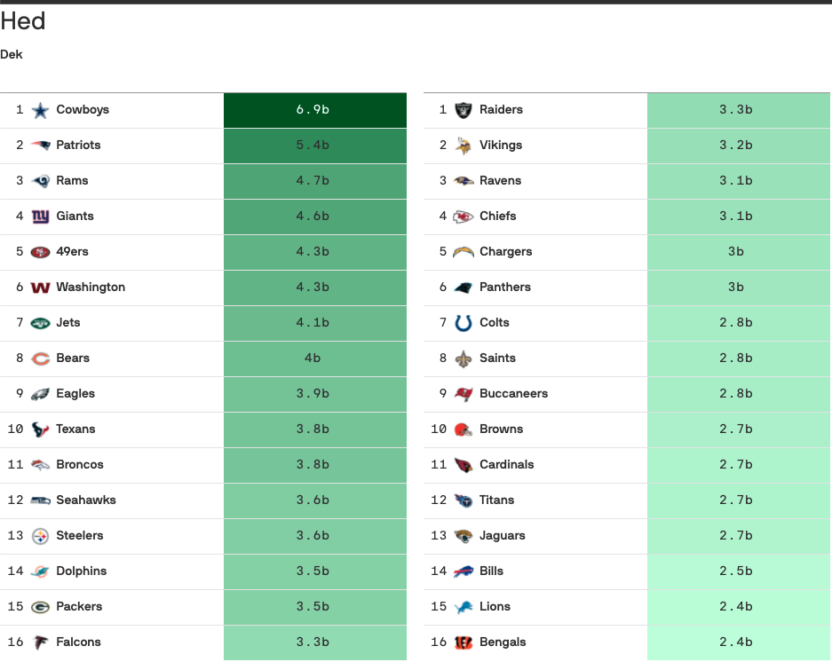
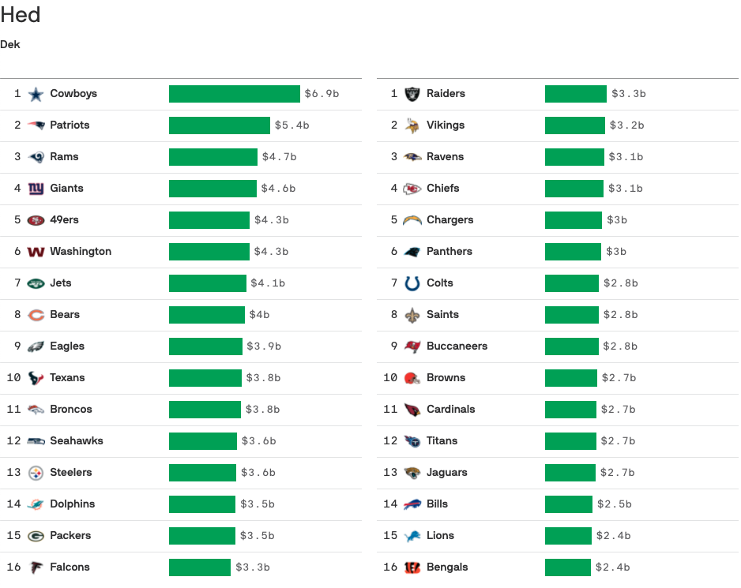
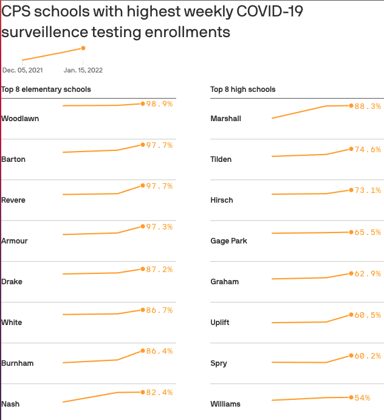

# Svelte template

## To get started

### Using degit

`degit` is a package that makes copies of a git repository's most recent commit. This allows for generating the scaffolding from this template directly from the command line.

Since this is a private repository, you'll need to set up SSH keys with your Github account. More information on how to do that [here](https://docs.github.com/en/github/authenticating-to-github/connecting-to-github-with-ssh/generating-a-new-ssh-key-and-adding-it-to-the-ssh-agent).

To install degit: `npm install -g degit`

To create a new project based on this template using [degit](https://github.com/Rich-Harris/degit):

```bash
npx degit axiosvisuals/svelte-table --mode=git test-app
cd test-app
```

### Using 'Use this template'

Click the `Use this template` button above and follow the instructions prompted by GitHub.

### Post-clone setup

In your local repo:

- Install the dependencies: `npm install`
- ~~Update `project.config.json` with your project's title and slug (TODO: make this automatic)~~
- Ctrl+F the term `[insert slug]` and replace it with your project slug. Also update the page title by ctrl+F'ing `[insert name]` and replacing it with a project name. (Or, you can manually update these in `public/index.html` and `project.config.json`.)
- Start the development server: `npm run dev`
- Navigate to [localhost:5000](http://localhost:5000). The app should run and update on changes.

## Template docs

### Modifying the table

- Table column names can be edited in `App.svelte`. At a minimum, each column must have a `label` and `visible` property.

```js
  const cols = [
    {
      label: "Rank", // Column Label
      visible: false, // Whether the label is visible or not
    },
    {
      label: "Logo",
      visible: false,
      ariaHidden: true, // Whether the column is visible to screen readers or not
    },
    {
      label: "Team",
      visible: false,
      class: "team", // Any additional classes the `<th>` cell will have
    },
    {
      label: "W-L",
      visible: true,
      ariaLabel: "Win-Loss Record", // Text the screen reader should read
    },
    ...
  ];
```

- `isSplitTable` is a `Boolean` and defines whether or not a single table should be split into two halves on larger screens.

## Components

### TableItemRow.svelte

Renders a `<tr>` in the table. Change the table cells in the markup section to display the metrics you want. It's important to note that if table headers are visible, you'll want the width for the table cells and table headers to match so they align.

### Heat.svelte



Renders a `<td>` with a heat table background using a linear color scale.

Mandatory props:

- max_value: This is already calculated in `Table.svelte`. Determines text color.
- extent: This is already calculated in `Table.svelte`. Determines cell color.
- cell_value: The value you want rendered in the table cell.

Optional props:

- class_string: Add a class to the cell.
- prefix: Symbol to add before the cell value.
- suffix: Symbol to add after the cell value.

### MiniBar.svelte



Renders a bar with CSS/HTML

Mandatory props:

- value: The value that's to be rendered as a bar
- max_value: This is already calculated in `Table.svelte`. Determines longest bar length.

Optional props:

- bar_color: A hex code to determine bar color. By default this is set to green.
- text_color: A hex code to determine text color. By default this is set to light text.
- prefix: Symbol to add before the bar value.
- suffix: Symbol to add after the bar value.

### Sparkline.svelte



Uses `layercake` to render a sparkline. Needs to be wrapped by a `td`. 

Before using the prop, you need to reshape the data so that the timeseries is inside an array. For example, in the [Chicago COVID-19 testing table](https://graphics.axios.com/2022-01-24-chi-schools-testing/index.html), the data is structed as such:

```
[
  {
    id: "609977", 
    data: [{...}, {...}, {...}]
  }
]
```

Mandatory props: 

- xKey: The variable name used as the x axis value for the sparkline
- yKey: The variable name used as the y axis value for the sparkline
- data: The data that will be rendered in the table
- parseDate: The date structure in your data. See [here](https://github.com/d3/d3-time-format) for additional documentation

Optional props: 
- prefix: Takes a string and adds that character before the value
- suffix: Takes a string and adds that character after the value. 
- color: Takes a hex code, renders the line in that color. 

### Logo.svelte

Returns an image tag with the logo from a desired league. 

Mandatory props: 

- league: Takes a string to determine what league to pull logos for. 
```
  const lookup = {      
        "college": "college-logos", 
        "euro-basketball": "euro-basketball", 
        "euro-football": "euro-football", 
        "mls": "mls-logos", 
        "milb": "milb-logos", 
        "mlb": "mlb-logos", 
        "nba": "nba-logos", 
        "nhl": "nhl-logos", 
        "nfl": "nfl-logos", 
        "nwsl": "nwsl-logos", 
        "wnba": "wnba-logos", 
    }
```
- team: The string of the team name

### Flag.svelte

Returns an image tag containing the flag of a country. 

Mandatory prop: 

- country: Takes a string of the country name. If the table doesn't render it's likely an issue with the country name not matching in `countryCodeLookup.json`


## Google Docs/Archie ML for copy

- Create a Google Doc or Sheet
- Click Share button -> advanced -> Change... -> to "Anyone with this link"
- In the address bar, grab the ID - eg. ...com/document/d/**1IiA5a5iCjbjOYvZVgPcjGzMy5PyfCzpPF-LnQdCdFI0**/edit
  paste in the ID above into `project.config.json`, and set the filepath to where you want the file saved
- If you want to do a Google Sheet, be sure to include the gid value in the url as well
- Running `npm run fetch-doc` at any point (even in new tab while server is running) will fetch the latest from all Docs and Sheets.
- Make sure any elements that include this copy use [@html](https://svelte.dev/tutorial/html-tags), so links/styling from the google doc can be properly incorporated

## Publishing

- Make sure your changes are committed to `master`
- `gulp publish` will push to `master`, build the app, and then deploy the built version to the S3 bucket specified in `project.config.json`
  - You'll be prompted to see if you want to generate fallbacks (for this to work, you'll need to have [localhost:5000](http://localhost:5000) running in another tab), they'll go in `public/fallbacks`
